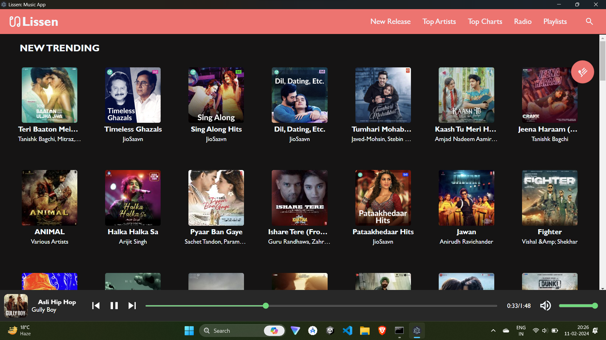
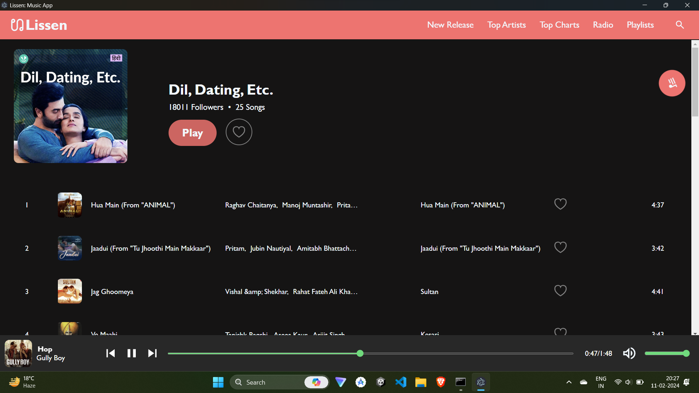
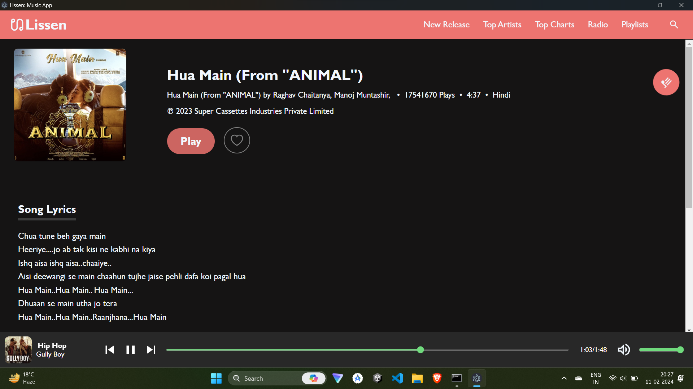
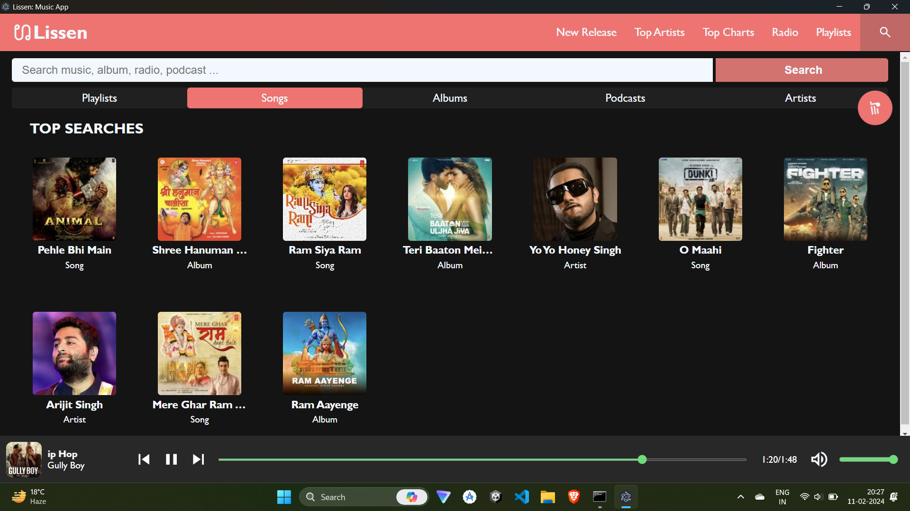
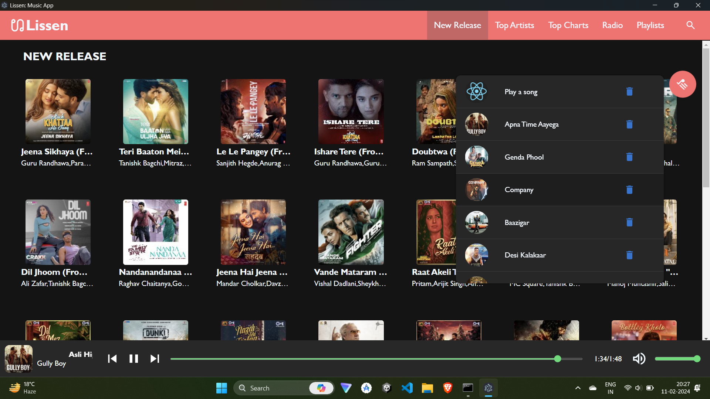

# Lissen - Yet another music Webapp

Music Webapp app made with React, Express, Node and Electron.

## Install

```sh
    git clone https://github.com/0x0is1/lissen.git
    cd lissen
    npm install
    npm run install:prod
```

## Start App

```sh
    # To run in browser
    npm start

    # To run as native electron app
    npm run app
```

## Previews
#### Home pages:



#### Type pages:



#### Lyrics page:



#### Search page:



#### Playlist widget:


